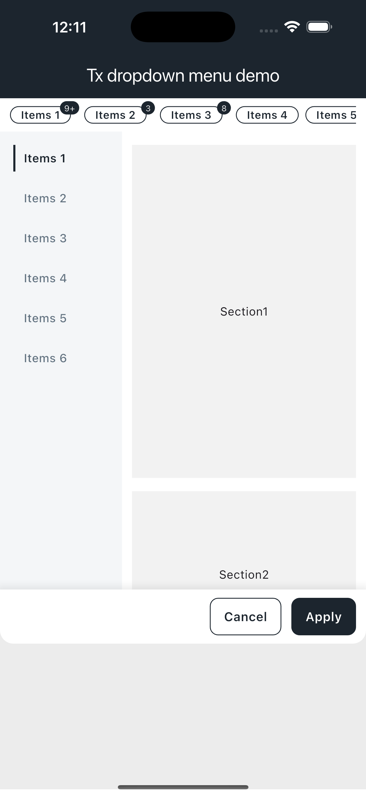

# tx_dropdown_menu

This is a Flutter custom powerful lightweight **drop-down filter menu** package, which supports iOS and Android.

# Preview



## 1、Add tx_dropdown_menu package

Open the pubspec.yaml file

```dart
  tx_dropdown_menu: ^1.0.0
```

After adding, open Terminal and execute flutter packages get

## 2. Use

### TxDropDownMenuHeader

**Please note that these parameters are not mandatory. I write them out just to let you know the powerful customization function. In fact, only the first three parameters are required**

```dart
TxDropdownMenuHeader(
  dropDownController: dropDownController,
  items: widget.items,
  onScrollToIndex: handleScrollToIndex,
  colorPrimary: widget.colorPrimary,
),
```

### TxDropDownMenuView

```dart
TxDropDownMenuView(
  dropDownController: dropDownController,
  currentIndexSelected: currentIndexSelected,
  controllerTitle: controllerTitle,
  items: widget.items,
  onScrollToIndex: handleScrollToIndex,
  controller: controller,
  actionGroup: widget.actionGroup,
  colorPrimary: widget.colorPrimary,
  viewHeight: widget.viewHeight,
),
```

### Custom show/hide menu

```dart
final TxDropDownMenuController dropDownController = TxDropDownMenuController();

//show menu
dropDownController.show(index);

//hide menu
dropDownController.hide();

//toggle menu
dropDownController.toggle();
```
